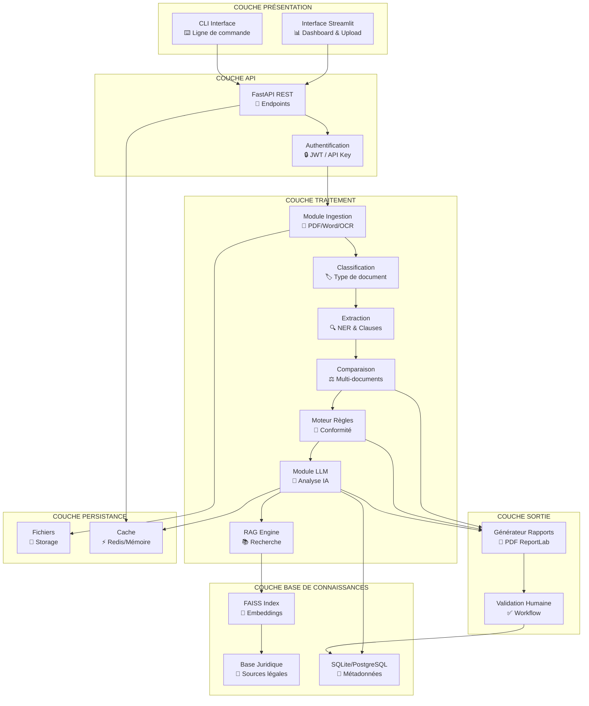
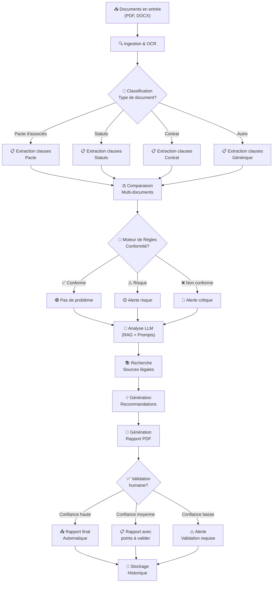

# TOP-JURIDIQUE — Architecture Technique

> Document de référence pour l'architecture du système TOP-JURIDIQUE.
> Version : 1.0 | Date : Juillet 2026

---

## 1. Vue d'ensemble

### 1.1 Diagramme d'architecture complet



### 1.2 Diagramme de flux des données



---

## 2. Description des couches

### 2.1 Couche Ingestion & OCR

**Module** : `ingestion/`

**Responsabilité** : Lire et normaliser les documents juridiques en entrée.

| Composant | Rôle | Technologies |
|-----------|------|-------------|
| `pdf_reader.py` | Extraction texte des PDF natifs | PyMuPDF (fitz) |
| `ocr_engine.py` | OCR des PDF scannés | Tesseract + pytesseract |
| `docx_reader.py` | Extraction texte des DOCX | python-docx |
| `preprocessor.py` | Nettoyage du texte | Regex, unicodedata |
| `file_manager.py` | Gestion des fichiers uploadés | shutil, pathlib |

**Flux interne** :
```
Fichier uploadé → Détection format → Extraction texte → 
Nettoyage → Segmentation en pages → Sortie : Texte brut structuré
```

**Modèle de sortie** :
```python
@dataclass
class IngestedDocument:
    file_path: str
    file_type: str  # pdf, docx
    raw_text: str
    pages: List[str]
    metadata: Dict  # titre, auteur, date, nb_pages
    is_scanned: bool
    ocr_confidence: float
```

### 2.2 Couche Classification

**Module** : `extraction/classification.py`

**Responsabilité** : Identifier le type de document juridique.

| Type de document | Modèles de détection |
|-----------------|---------------------|
| Pacte d'associés | Présence de clauses spécifiques (agrément, préemption, sortie) |
| Statuts de société | Structure type (forme juridique, capital, gouvernance) |
| Contrat | Présence de parties, objet, prix, durée |
| Avenant | Référence à un contrat initial |
| Convention | Parties, objet, contreparties |

**Approche** :
1. **Règles regex** : détection rapide par mots-clés
2. **Classification sémantique** : embedding + similarité cosine
3. **LLM** : classification de fallback pour cas ambigus

**Modèle de sortie** :
```python
@dataclass
class DocumentClassification:
    document_type: str  # pacte, statuts, contrat, avenant, convention
    confidence: float  # 0.0 - 1.0
    sub_type: Optional[str]  # SAS, SARL, SA, etc.
    detected_entities: Dict  # parties, dates, etc.
```

### 2.3 Couche Extraction

**Module** : `extraction/`

**Responsabilité** : Extraire les clauses et informations structurées.

| Composant | Rôle | Technologies |
|-----------|------|-------------|
| `clause_extractor.py` | Identification et segmentation des clauses | spaCy, regex |
| `ner_engine.py` | Extraction d'entités nommées juridiques | HuggingFace NER |
| `clause_categorizer.py` | Catégorisation des clauses | Embeddings + classification |
| `info_extractor.py` | Extraction d'informations spécifiques | Regex + LLM |
| `structured_output.py` | Conversion en JSON structuré | Pydantic |

**Modèle de sortie** :
```python
@dataclass
class ExtractedClause:
    id: str
    document_id: str
    category: str  # gouvernance, cession, sortie, etc.
    title: str
    original_text: str
    summary: str
    legal_references: List[str]
    obligations: List[str]
    conditions: List[str]
    deadlines: List[str]
    sanctions: List[str]
    risk_flags: List[str]
    confidence: float
    position: Tuple[int, int]  # début, fin dans le document
```

### 2.4 Couche Comparaison

**Module** : `comparison/`

**Responsabilité** : Comparer les clauses entre documents et détecter les écarts.

| Composant | Rôle |
|-----------|------|
| `clause_matcher.py` | Apparier les clauses correspondantes entre documents |
| `contradiction_detector.py` | Détecter les contradictions directes et implicites |
| `gap_analyzer.py` | Identifier les clauses manquantes |
| `similarity_engine.py` | Calculer la similarité sémantique entre clauses |
| `severity_scorer.py` | Évaluer la sévérité des écarts |

**Algorithme de comparaison** :
```
1. Catégoriser les clauses de chaque document
2. Apparier les clauses par catégorie
3. Pour chaque paire appareillée :
   a. Calculer similarité sémantique
   b. Si similarité < seuil → vérifier contradiction
   c. Extraire les différences clés
   d. Évaluer la sévérité
4. Pour les catégories sans paire :
   a. Identifier comme "manquante"
   b. Évaluer le risque d'absence
5. Score global de conformité
```

**Modèle de sortie** :
```python
@dataclass
class ComparisonResult:
    matched_clauses: List[ClauseMatch]
    contradictions: List[Contradiction]
    missing_clauses: List[MissingClause]
    similarity_scores: Dict[str, float]
    overall_conformity_score: float
    severity_distribution: Dict[str, int]
```

### 2.5 Couche Moteur de Règles

**Module** : `rules_engine/`

**Responsabilité** : Vérifier la conformité par rapport à des règles juridiques codées.

| Composant | Rôle |
|-----------|------|
| `rule_loader.py` | Chargement des règles depuis fichiers YAML/JSON |
| `rule_evaluator.py` | Évaluation des règles sur les clauses extraites |
| `compliance_checker.py` | Vérification de conformité légale |
| `risk_identifier.py` | Identification des risques juridiques |
| `rule_registry.py` | Registre des règles par domaine |

**Format des règles** :
```yaml
# rules/cession_agrement.yaml
rule_id: CESS-AGR-001
name: "Clause d'agrément obligatoire pour SAS"
domain: "societes"
document_types: ["statuts", "pacte"]
societe_form: ["SAS", "SASU"]
severity: "critique"
condition: "Si forme = SAS, alors clause d'agrément requise"
reference: "Art. L227-19 Code de commerce"
description: "La cession d'actions est libre entre associés, 
             mais une clause d'agrément peut être prévue"
recommendation: "Prévoir une clause d'agrément pour contrôler 
                 l'entrée de nouveaux associés"
```

### 2.6 Couche Base de Connaissances Juridiques (RAG)

**Module** : `legal_kb/` + `rag/`

**Responsabilité** : Fournir le contexte juridique pertinent pour l'analyse LLM.

| Composant | Rôle | Technologies |
|-----------|------|-------------|
| `source_collector.py` | Collecte des sources légales | Scraping Légifrance, téléchargement |
| `chunker.py` | Découpage en chunks pertinents | LangChain TextSplitter |
| `embedder.py` | Génération des embeddings | HuggingFace Sentence Transformers |
| `indexer.py` | Indexation dans FAISS | FAISS |
| `retriever.py` | Recherche sémantique | FAISS + reranking |
| `reranker.py` | Re-ranking des résultats | Cross-encoder |

**Pipeline RAG** :
```
Requête (clause ou question) → 
Génération embedding → 
Recherche FAISS top-k → 
Reranking → 
Contexte pertinent → 
Enrichissement prompt LLM
```

**Sources de la base juridique** :
- Code civil (parties pertinentes)
- Code de commerce (parties pertinentes)
- Code des sociétés (si applicable)
- Articles de doctrine pertinents
- Jurisprudences clés
- Modèles types (clauses de référence)

### 2.7 Couche LLM Analysis

**Module** : `llm/`

**Responsabilité** : Analyser les données extraites et générer des insights.

| Composant | Rôle |
|-----------|------|
| `model_manager.py` | Gestion des modèles (chargement, cache, bascule) |
| `prompt_engine.py` | Construction et gestion des prompts |
| `analyzer.py` | Chaîne d'analyse juridique |
| `recommender.py` | Génération de recommandations |
| `summarizer.py` | Résumé des analyses |

**Chaîne d'analyse LLM** :
```
Input : Clauses extraites + Contexte RAG + Règles applicables
    ↓
Prompt : "Analyser ces clauses du point de vue juridique..."
    ↓
LLM : Génération d'analyse structurée
    ↓
Post-traitement : Extraction des points clés, scoring
    ↓
Output : Analyse avec recommandations
```

**Modèles utilisés** :
- **Primaire** : Mistral-7B-Instruct (ou variante)
- **Fallback** : CamemBERT (pour NLP)
- **Embeddings** : sentence-transformers/all-MiniLM-L6-v2

### 2.8 Couche Génération de Rapports

**Module** : `report_generator/`

**Responsabilité** : Créer des rapports PDF professionnels.

| Composant | Rôle | Technologies |
|-----------|------|-------------|
| `pdf_builder.py` | Construction du PDF | ReportLab |
| `template_engine.py` | Gestion des templates | Jinja2 |
| `chart_generator.py` | Graphiques d'analyse | Matplotlib → Images |
| `table_formatter.py` | Tableaux comparatifs | ReportLab Tables |
| `export_manager.py` | Export multi-format | PDF, DOCX, JSON |

**Structure du PDF** :
- Page de garde (logo TOP-JURIDIQUE, titre, date)
- Sommaire cliquable
- Résumé exécutif avec scoring
- Tableaux comparatifs
- Détail des problèmes identifiés
- Références légales
- Propositions d'amélioration
- Annexes

### 2.9 Couche Validation Humaine

**Module** : `validation/`

**Responsabilité** : Permettre la validation et correction par un expert humain.

| Composant | Rôle |
|-----------|------|
| `confidence_scorer.py` | Attribution des scores de confiance |
| `validation_workflow.py` | Workflow d'approbation |
| `annotation_ui.py` | Interface d'annotation (Streamlit) |
| `correction_handler.py` | Gestion des corrections |
| `audit_trail.py` | Piste d'audit complète |

**Niveaux de confiance** :
| Score | Niveau | Action |
|-------|--------|--------|
| ≥ 0.90 | Haute | Rapport généré automatiquement |
| 0.70 - 0.89 | Moyenne | Points à valider signalés |
| < 0.70 | Basse | Validation humaine obligatoire |

### 2.10 Couche API (TOP-JURIDIQUE Integration)

**Module** : `api/`

**Responsabilité** : Exposer les fonctionnalités via une API REST.

| Endpoint | Méthode | Description |
|----------|---------|-------------|
| `POST /api/v1/analyze` | POST | Lancer une analyse complète |
| `GET /api/v1/status/{job_id}` | GET | Statut d'une analyse en cours |
| `GET /api/v1/report/{report_id}` | GET | Télécharger un rapport |
| `GET /api/v1/documents` | GET | Lister les documents analysés |
| `POST /api/v1/validate` | POST | Soumettre une validation |
| `GET /api/v1/sources` | GET | Rechercher dans la base juridique |

**Framework** : FastAPI + Pydantic + Uvicorn

---

## 3. Flux de données détaillé

### 3.1 Flux complet : Analyse d'un pacte vs statuts

```
1. UPLOAD
   Utilisateur upload Pacte.pdf + Statuts.pdf
   → API reçoit les fichiers
   → Stockage temporaire dans /tmp/uploads/

2. INGESTION
   pdf_reader extrait le texte de Pacte.pdf
   pdf_reader extrait le texte de Statuts.pdf
   preprocessor nettoie le texte
   → Sortie : 2 IngestedDocument

3. CLASSIFICATION
   classification identifie Pacte = "pacte_associés" (confiance: 0.95)
   classification identifie Statuts = "statuts_societe" (confiance: 0.98)
   → Sortie : 2 DocumentClassification

4. EXTRACTION
   clause_extractor segmente chaque document en clauses
   ner_engine extrait les entités (parties, dates, montants)
   clause_categorizer catégorise chaque clause
   → Sortie : Liste d'ExtractedClause (ex: 15 clauses pacte, 20 clauses statuts)

5. COMPARAISON
   clause_matcher appareille les clauses par catégorie
   contradiction_detector identifie les écarts
   gap_analyzer identifie les clauses manquantes
   → Sortie : ComparisonResult

6. RÈGLES
   rule_evaluator applique les règles de conformité
   risk_identifier identifie les risques
   → Sortie : Liste de règles violées et risques

7. RAG
   retriever recherche les sources légales pertinentes
   → Sortie : Contexte juridique pour chaque problème

8. LLM ANALYSIS
   analyzer génère l'analyse pour chaque problème
   recommender génère les recommandations
   → Sortie : Analyse structurée

9. RAPPORT
   pdf_builder génère le PDF
   → Sortie : rapport_final.pdf

10. VALIDATION
    confidence_scorer évalue la confiance
    → Si confiance haute : envoi automatique
    → Si confiance moyenne/basse : demande de validation

11. STOCKAGE
    Métadonnées en SQLite
    Rapport en filesystem
    → Historique des analyses
```

---

## 4. Choix technologiques justifiés

### 4.1 Langage : Python

| Critère | Évaluation |
|---------|-----------|
| Écosystème IA/ML | ⭐⭐⭐⭐⭐ Le meilleur écosystème (PyTorch, HuggingFace, spaCy) |
| Bibliothèques juridiques | ⭐⭐⭐ Bonne disponibilité |
| Rapidité de développement | ⭐⭐⭐⭐⭐ Très productif |
| Performance | ⭐⭐⭐ Suffisante pour un prototype |
| Communauté | ⭐⭐⭐⭐⭐ La plus grande communauté |

### 4.2 Framework LLM : LangChain

| Critère | Évaluation |
|---------|-----------|
| Intégration multi-LLM | ⭐⭐⭐⭐⭐ Supporte HuggingFace, OpenAI, etc. |
| Gestion de chaînes | ⭐⭐⭐⭐⭐ Chains, agents, mémoire |
| RAG intégré | ⭐⭐⭐⭐⭐ Retrieval, routing, reranking |
| Documentation | ⭐⭐⭐⭐ Bonne |
| Maturité | ⭐⭐⭐ En évolution rapide |

### 4.3 Base vectorielle : FAISS

| Critère | Évaluation |
|---------|-----------|
| Performance | ⭐⭐⭐⭐⭐ Très rapide |
| Légèreté | ⭐⭐⭐⭐⭐ Pas de serveur externe |
| Scalabilité | ⭐⭐⭐⭐ Gère des millions de vecteurs |
| Facilité d'utilisation | ⭐⭐⭐⭐ API simple |
| Coût | ⭐⭐⭐⭐⭐ Gratuit (Facebook) |

### 4.4 Modèles : HuggingFace

| Critère | Évaluation |
|---------|-----------|
| Modèles open-source | ⭐⭐⭐⭐⭐ Accès libre |
| Modèles français | ⭐⭐⭐⭐ CamemBERT, PhBERT, Mistral |
| Fine-tuning | ⭐⭐⭐⭐⭐ Facilité d'entraînement |
| Quantization | ⭐⭐⭐⭐ Réduction de taille possible |
| Communauté | ⭐⭐⭐⭐⭐ La plus grande |

### 4.5 Interface : Streamlit

| Critère | Évaluation |
|---------|-----------|
| Rapidité de prototypage | ⭐⭐⭐⭐⭐ Très rapide |
| UI interactive | ⭐⭐⭐⭐ Widgets interactifs |
| Data science | ⭐⭐⭐⭐ Natif Python |
| Déploiement | ⭐⭐⭐ Simple |
| Production | ⭐⭐⭐ Limité |

### 4.6 Rapports : ReportLab

| Critère | Évaluation |
|---------|-----------|
| PDF natif | ⭐⭐⭐⭐⭐ Génération PDF complète |
| Mise en page | ⭐⭐⭐⭐⭐ Contrôle total |
| Tableaux | ⭐⭐⭐⭐ Excellents tableaux |
| Graphiques | ⭐⭐⭐ Supporté via images |
| Complexité | ⭐⭐⭐ Courbe d'apprentissage |

---

## 5. Arborescence du projet

```
top-juridique-copilote/
│
├── docs/                           # Documentation
│   ├── 01_comprehension_mission.md
│   ├── 02_benchmark.md
│   ├── 03_cas_usage.md
│   └── 04_architecture.md
│
├── ingestion/                      # Module d'ingestion
│   ├── __init__.py
│   ├── pdf_reader.py               # Lecture PDF (PyMuPDF)
│   ├── ocr_engine.py               # OCR (Tesseract)
│   ├── docx_reader.py              # Lecture DOCX
│   ├── preprocessor.py             # Nettoyage texte
│   └── file_manager.py             # Gestion fichiers
│
├── extraction/                     # Module d'extraction
│   ├── __init__.py
│   ├── classification.py           # Classification documents
│   ├── clause_extractor.py         # Extraction de clauses
│   ├── ner_engine.py               # NER juridique
│   ├── clause_categorizer.py       # Catégorisation
│   ├── info_extractor.py           # Extraction d'infos
│   └── structured_output.py        # Sortie structurée
│
├── comparison/                     # Module de comparaison
│   ├── __init__.py
│   ├── clause_matcher.py           # Appariement clauses
│   ├── contradiction_detector.py   # Détection contradictions
│   ├── gap_analyzer.py             # Analyse écarts
│   ├── similarity_engine.py        # Similarité sémantique
│   └── severity_scorer.py          # Scoring sévérité
│
├── rules_engine/                   # Moteur de règles
│   ├── __init__.py
│   ├── rule_loader.py              # Chargement règles
│   ├── rule_evaluator.py           # Évaluation règles
│   ├── compliance_checker.py       # Vérification conformité
│   ├── risk_identifier.py          # Identification risques
│   └── rules/                      # Règles juridiques
│       ├── cession_agrement.yaml
│       ├── gouvernance.yaml
│       ├── sortie.yaml
│       ├── anti_dilution.yaml
│       └── conformite_generale.yaml
│
├── legal_kb/                       # Base de connaissances
│   ├── __init__.py
│   ├── source_collector.py         # Collecte sources
│   ├── chunker.py                  # Découpage chunks
│   ├── embedder.py                 # Génération embeddings
│   ├── indexer.py                  # Indexation FAISS
│   ├── retriever.py                # Recherche sémantique
│   ├── reranker.py                 # Re-ranking
│   └── sources/                    # Sources juridiques
│       ├── code_civil/
│       ├── code_commerce/
│       ├── doctrine/
│       └── jurisprudence/
│
├── rag/                            # Moteur RAG
│   ├── __init__.py
│   ├── rag_engine.py               # Pipeline RAG
│   ├── prompt_builder.py           # Construction prompts
│   └── context_formatter.py        # Formatage contexte
│
├── llm/                            # Module LLM
│   ├── __init__.py
│   ├── model_manager.py            # Gestion modèles
│   ├── prompt_engine.py            # Moteur de prompts
│   ├── analyzer.py                 # Chaîne d'analyse
│   ├── recommender.py              # Générateur recommandations
│   └── summarizer.py               # Résumé
│
├── report_generator/               # Générateur de rapports
│   ├── __init__.py
│   ├── pdf_builder.py              # Construction PDF
│   ├── template_engine.py          # Moteur templates
│   ├── chart_generator.py          # Génération graphiques
│   ├── table_formatter.py          # Formatage tableaux
│   ├── export_manager.py           # Export multi-format
│   └── templates/                  # Templates
│       ├── report_template.html
│       └── styles/
│
├── validation/                     # Validation humaine
│   ├── __init__.py
│   ├── confidence_scorer.py        # Scoring confiance
│   ├── validation_workflow.py      # Workflow validation
│   ├── annotation_ui.py            # Interface annotation
│   ├── correction_handler.py       # Gestion corrections
│   └── audit_trail.py              # Piste d'audit
│
├── api/                            # API REST
│   ├── __init__.py
│   ├── main.py                     # Point d'entrée FastAPI
│   ├── routes/
│   │   ├── analysis.py             # Routes d'analyse
│   │   ├── documents.py            # Routes documents
│   │   ├── reports.py              # Routes rapports
│   │   └── sources.py              # Routes sources
│   ├── models/                     # Modèles Pydantic
│   │   ├── requests.py
│   │   └── responses.py
│   └── middleware/                  # Middleware
│       ├── auth.py
│       └── logging.py
│
├── tests/                          # Tests
│   ├── __init__.py
│   ├── test_ingestion.py
│   ├── test_extraction.py
│   ├── test_comparison.py
│   ├── test_rules_engine.py
│   ├── test_rag.py
│   ├── test_llm.py
│   ├── test_report.py
│   ├── test_api.py
│   └── fixtures/                   # Données de test
│       ├── pacte_sample.pdf
│       ├── statuts_sample.pdf
│       └── expected_results.json
│
├── examples/                       # Exemples
│   ├── example_sas_pacte/
│   │   ├── pacte_sas.pdf
│   │   └── statuts_sas.pdf
│   └── output/
│       └── rapportexemple.pdf
│
├── config/                         # Configuration
│   ├── settings.yaml               # Paramètres généraux
│   ├── models.yaml                 # Configuration modèles
│   └── rules_config.yaml           # Configuration règles
│
├── scripts/                        # Scripts utilitaires
│   ├── setup.py                    # Installation
│   ├── download_sources.py         # Téléchargement sources
│   ├── build_index.py              # Construction index FAISS
│   └── run_demo.py                 # Lancement démo
│
├── requirements.txt                # Dépendances Python
├── pyproject.toml                  # Configuration projet
├── README.md                       # Documentation principale
├── LICENSE                         # Licence
├── .gitignore                      # Fichiers ignorés
└── .env.example                    # Variables d'environnement
```

---

## 6. Dépendances Python

### requirements.txt

```
# Core
python>=3.11
pydantic>=2.0
pyyaml>=6.0

# PDF & Document Processing
PyMuPDF>=1.23.0
python-docx>=1.0.0
pytesseract>=0.3.10
Pillow>=10.0.0

# NLP & ML
spacy>=3.7.0
transformers>=4.35.0
sentence-transformers>=2.2.0
torch>=2.1.0

# LLM Framework
langchain>=0.1.0
langchain-community>=0.0.10
langchain-huggingface>=0.0.1

# Vector Store
faiss-cpu>=1.7.4

# Web Interface
streamlit>=1.29.0

# API
fastapi>=0.108.0
uvicorn>=0.25.0
python-multipart>=0.0.6

# Report Generation
reportlab>=4.0.0
Jinja2>=3.1.0
matplotlib>=3.8.0

# Utilities
python-dotenv>=1.0.0
loguru>=0.7.0
tqdm>=4.66.0
aiofiles>=23.2.0

# Testing
pytest>=7.4.0
pytest-cov>=4.1.0
pytest-asyncio>=0.23.0

# Development
black>=23.12.0
ruff>=0.1.0
mypy>=1.7.0
```

---

## 7. Configuration

### config/settings.yaml

```yaml
app:
  name: "TOP-JURIDIQUE"
  version: "1.0.0"
  debug: false

ingestion:
  max_file_size_mb: 50
  supported_formats: ["pdf", "docx"]
  ocr_enabled: true
  ocr_language: "fra"

extraction:
  chunk_size: 500
  chunk_overlap: 50
  min_clause_length: 50

classification:
  confidence_threshold: 0.7
  fallback_to_llm: true

comparison:
  similarity_threshold: 0.8
  contradiction_threshold: 0.3

rules_engine:
  rules_path: "rules_engine/rules/"
  severity_levels: ["critique", "majeure", "mineure"]

legal_kb:
  index_path: "legal_kb/index/"
  sources_path: "legal_kb/sources/"
  embedding_model: "sentence-transformers/all-MiniLM-L6-v2"
  chunk_size: 1000
  top_k: 5

llm:
  primary_model: "mistralai/Mistral-7B-Instruct-v0.2"
  fallback_model: "camembert-base"
  max_tokens: 4096
  temperature: 0.3
  quantized: true

report:
  output_dir: "output/reports/"
  template_dir: "report_generator/templates/"
  logo_path: "assets/logo.png"

validation:
  high_confidence_threshold: 0.90
  medium_confidence_threshold: 0.70
  auto_validate_high: true

api:
  host: "0.0.0.0"
  port: 8000
  cors_origins: ["http://localhost:8501"]

storage:
  database_url: "sqlite:///top_juridique.db"
  upload_dir: "uploads/"
  cache_dir: "cache/"
```

---

## 8. Considérations de sécurité

| Aspect | Mesure |
|--------|--------|
| **Données utilisateur** | Pas de stockage persistant des documents sensibles |
| **Chiffrement** | HTTPS en production, chiffrement au repos |
| **Authentification** | JWT / API Key pour l'accès API |
| **RGPD** | Minimisation des données, droit à l'oubli |
| **Audit** | Piste d'audit complète sur chaque analyse |
| **Sécurité LLM** | Pas de données dans les modèles publics |
| **Vulnérabilités** | Pas de code exécuté dynamiquement |

---

## 9. Scalabilité et évolution

### Phase 1 (Stage - 2 mois)
- Prototype fonctionnel
- Cas d'usage unique (pacte vs statuts)
- Interface Streamlit
- Base juridique v1

### Phase 2 (Post-stage - 6 mois)
- Production-ready
- Multi-cas d'usage
- API sécurisée
- Base juridique complète
- Monitoring et logging

### Phase 3 (1 an)
- Multi-lingue (anglais)
- Fine-tuning modèles juridiques
- Intégration logiciels tiers (Clio, etc.)
- Application mobile
- Certifications

---

## 10. Monitoring et observabilité

| Composant | Outil | Métriques |
|-----------|-------|-----------|
| **API** | Prometheus + Grafana | Latence, throughput, erreurs |
| **LLM** | LangSmith | Qualité réponses, coûts tokens |
| **Logs** | Loguru → ELK | Erreurs, warnings, infos |
| **Performance** | cProfile | Temps par module |
| **Qualité** | Tests pytest | Couverture, pass rate |

---

## 11. Plan de déploiement

### Développement local
```bash
# Installation
pip install -r requirements.txt
python -m spacy download fr_core_news_sm

# Construction de l'index
python scripts/build_index.py

# Lancement
python scripts/run_demo.py
# ou
streamlit run app.py
```

### Production (future)
```bash
# Docker
docker build -t top-juridique .
docker run -p 8000:8000 top-juridique

# Ou directement
uvicorn api.main:app --host 0.0.0.0 --port 8000
```

---

*Document généré pour le projet TOP-JURIDIQUE — Architecture Technique v1.0*
