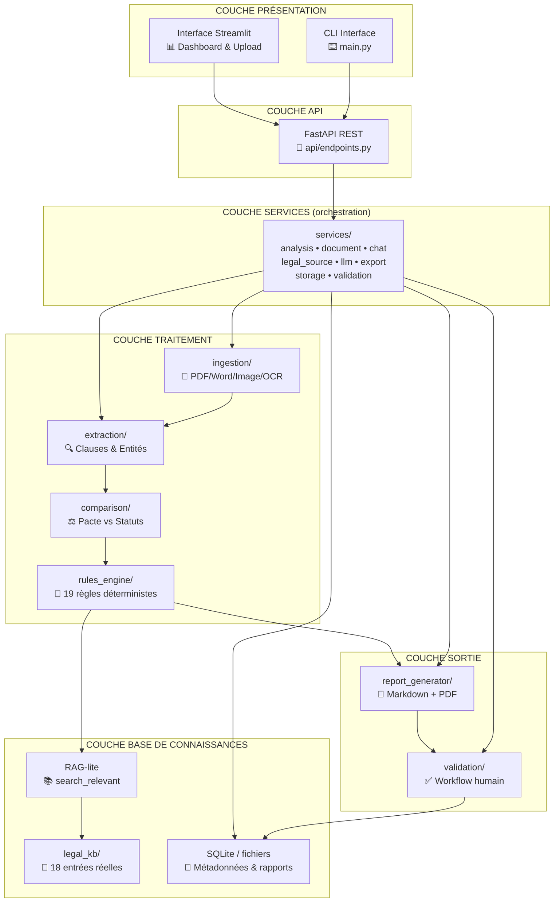
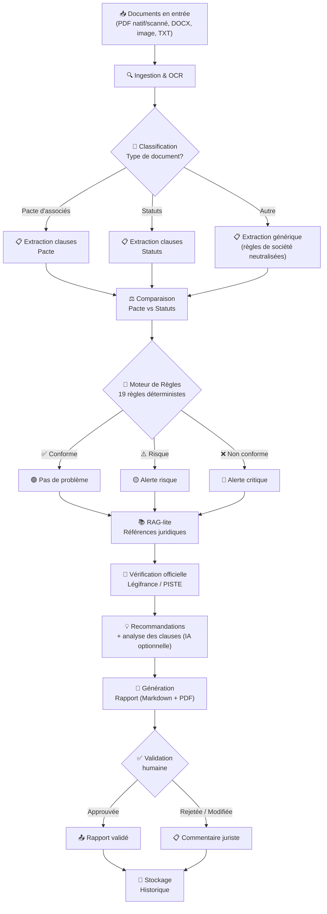

# TOP-JURIDIQUE — Architecture Technique

> Document de référence pour l'architecture du système TOP-JURIDIQUE.
> Version : 2.0 | Date : Août 2026

> **Mise à jour (état actuel)** : ce document décrit l'architecture **réellement implémentée**. Les modules `rag/` et `llm/` initialement prévus n'existent pas : la recherche contextuelle est réalisée en local via le **RAG-lite** (`legal_kb/knowledge_base.py`), et l'IA optionnelle (Groq/OpenRouter) est orchestrée par `services/llm_service.py` avec repli local déterministe. Voir aussi `README_ARCHITECTURE.md` pour la vue opérationnelle.

---

## 1. Vue d'ensemble

### 1.1 Diagramme d'architecture complet



### 1.2 Diagramme de flux des données



---

## 2. Description des couches

### 2.1 Couche Ingestion & OCR

**Module** : `ingestion/`

**Responsabilité** : Lire et normaliser les documents juridiques en entrée. Orchestré par `services/document_service.py`.

| Composant | Rôle | Technologies |
|-----------|------|-------------|
| `ocr_engine.py` | OCR des PDF scannés et images (détection automatique du besoin d'OCR) | Tesseract (français) + pytesseract + PyMuPDF |
| `services/document_service.py` | Lecture de tous les formats + classification du type de document + évaluation de la qualité de lecture | PyPDF2, PyMuPDF, python-docx, Pillow |

**Formats supportés** : PDF natif, PDF scanné (OCR), Word (docx), images (PNG/JPG/JPEG), texte (TXT).

**Flux interne** :
```
Fichier uploadé → Détection format → Extraction texte → 
Si texte vide/insuffisant → OCR (Tesseract) → Évaluation qualité (illisible, scan faible, page manquante, document incomplet)
```

**Sortie** : texte brut + `DocumentQuality` (qualité de lecture) + type de document détecté (pacte, statuts, procès-verbal, modification statutaire, autre).

### 2.2 Couche Extraction

**Module** : `extraction/`

**Responsabilité** : Extraire les clauses et les informations structurées.

| Composant | Rôle | Technologies |
|-----------|------|-------------|
| `clause_extractor.py` | Découpe le texte en clauses titrées (agrément, cession, veto, non-concurrence…) | Regex + structure documentaire |
| `entity_extractor.py` | Dates, montants, organisations/parties, références d'articles (ex. L223-14, 1103 C. civ) | Regex + règles de normalisation |

**Modèle de sortie** :
```python
@dataclass
class ExtractedClause:
    titre: str
    texte: str
    niveau_risque: str          # faible / modéré / élevé (via llm_service)
    analyse: str                # analyse IA ou repli local
    amelioration: str           # amélioration argumentée
    fondement_juridique: str
```

### 2.3 Couche Comparaison

**Module** : `comparison/`

**Responsabilité** : Comparer deux documents (pacte vs statuts) et détecter les incohérences.

| Composant | Rôle |
|-----------|------|
| `document_comparator.py` | Croise 2 documents : dates, montants, parties, clauses ; produit des incohérences avec sévérité |

**Points vérifiés** : dates divergentes, montants (capital, valorisation), acteurs (reconnaissance robuste : « SARL TOP LEGAL CONSEIL » ≠ « STATUTS DE LA SOCIETE TOP LEGAL CONSEIL » → pas de faux positif), clauses contradictoires.

### 2.4 Couche Moteur de Règles

**Module** : `rules_engine/`

**Responsabilité** : Vérifier la conformité par rapport à des règles juridiques codées.

| Composant | Rôle |
|-----------|------|
| `rules.py` | **19 règles** déterministes (comparaisons insensibles aux accents) |
| `rule_checker.py` | Orchestrateur : applique les règles, déduplique, adapte à la forme sociale (SAS/SARL/SCI…) |

**Les 19 règles** :
1. Clause d'agrément
2. Clause de sortie (drag-along / tag-along)
3. Droit de veto
4. Majorités de décision
5. Clause de non-concurrence
6. Contradiction pacte / statuts
7. Clause de blocage (médiation/arbitrage)
8. Responsabilité / pouvoirs du gérant
9. PV — quorum
10. PV — résolutions
11. Modification statutaire
12. Champs à compléter
13. Formulations / forme
14. **Risque futur** — valorisation des titres en sortie
15. **Risque futur** — décès / incapacité d'un associé
16. **Risque futur** — non-paiement (impayé)
17. **Risque futur** — confidentialité / secret des affaires
18. **Risque futur** — résiliation (durée / engagement sans issue)
19. **Risque futur** — déséquilibre de gouvernance (protection du minoritaire)

Chaque anomalie comporte : explication, nature du contrôle, priorité (bloquant / important / alerte), conséquence possible, correction recommandée, documents à vérifier, validation humaine requise.

### 2.5 Couche Base de Connaissances Juridiques (RAG-lite)

**Module** : `legal_kb/`

**Responsabilité** : Fournir les références juridiques pertinentes pour chaque anomalie.

| Composant | Rôle | Technologies |
|-----------|------|-------------|
| `schema.json` | Schéma de validation des entrées | JSON Schema |
| `data/societes.json` | 10 entrées droit des sociétés (Code de commerce) | JSON |
| `data/pactes.json` | 8 entrées pactes d'associés (Code civil / proc. civile) | JSON |
| `knowledge_base.py` | Chargement, recherche **RAG-lite** `search_relevant`, vérification schéma | Python |

**Pipeline RAG-lite** :
```
Chaque anomalie → type de document + termes de l'anomalie + domaine
→ classement des entrées (type de document + chevauchement de termes)
→ retour des articles et règles de contrôle pertinents
→ vérification officielle Légifrance (services/legal_source_service.py)
```

**Sources de la base juridique** : Code de commerce (10 entrées), Code civil et procédure civile (8 entrées) — articles **réels**, aucune référence inventée.

### 2.6 Couche Services (orchestration)

**Module** : `services/`

**Responsabilité** : Orchestrer le pipeline complet et les fonctions transverses.

| Composant | Rôle |
|-----------|------|
| `analysis_service.py` | Pipeline : lecture → extraction → comparaison → règles → RAG-lite → rapport ; formatage Markdown |
| `document_service.py` | Lecture multi-format + classification + qualité de lecture |
| `chat_service.py` | Chatbot : recherche locale des passages pertinents |
| `legal_source_service.py` | Vérification officielle des références (jeton PISTE OAuth2, recherche Légifrance, lien de secours) |
| `llm_service.py` | IA optionnelle : Groq prioritaire, OpenRouter secours, **repli local déterministe** si échec/sans clé ; synthèse + analyse de clauses |
| `export_service.py` | Exports PDF/Markdown/JSON + export de conversation (TXT/PDF) |
| `storage_service.py` | Sauvegarde des rapports et métadonnées |
| `validation_service.py` | Gestion des validations humaines |

### 2.7 Couche Génération de Rapports

**Module** : `report_generator/`

| Composant | Rôle | Technologies |
|-----------|------|-------------|
| `report_builder.py` | Construction du rapport structuré (documents, entités, anomalies, incohérences, risque global, statut de vérification des sources) | Python |
| `report_export.py` | Export Markdown et PDF | ReportLab |

**Structure du rapport** : documents analysés, informations principales, anomalies une par une (avec source vérifiée), incohérences, niveau de risque, recommandations, points à valider.

### 2.8 Couche Validation Humaine

**Module** : `validation/`

**Responsabilité** : Permettre la validation et correction par un expert humain.

| Composant | Rôle |
|-----------|------|
| `validator.py` | Approbation / rejet (avec motif) / modification de chaque anomalie ; calcul du taux de validation |

La décision finale reste toujours à la charge du juriste ou du formaliste.

### 2.9 Couche API (TOP-JURIDIQUE Integration)

**Module** : `api/`

| Endpoint | Méthode | Description |
|----------|---------|-------------|
| `POST /analyze` | POST | Lancer une analyse (un ou plusieurs documents) |
| `GET /report/{id}` | GET | Récupérer un rapport |
| `POST /validate/{id}/{anomalie}` | POST | Valider une anomalie |
| `GET /health` | GET | État du service |

**Framework** : FastAPI + Pydantic. Documentation interactive sur `/docs`. Point d'entrée : `run_api.py`.

### 2.10 Couche Présentation

**Module** : `ui/` + `app.py`

| Composant | Rôle |
|-----------|------|
| `app.py` | Application Streamlit (upload, analyse, rapport, chat) |
| `ui/components.py` | En-tête, badges de risque, cartes d'anomalies, KPI |
| `ui/styles.py` | Thème professionnel navy/or |
| `ui/chat_display.py` | Affichage de la conversation, Markdown → HTML |
| `main.py` | Interface ligne de commande (CLI) |

---

## 3. Flux de données détaillé

### 3.1 Flux complet : Analyse d'un pacte vs statuts

```
1. UPLOAD
   Utilisateur dépose Pacte.pdf + Statuts.pdf (web, CLI ou API)

2. INGESTION
   document_service lit chaque fichier (PDF natif / OCR si scanné)
   → classification (pacte, statuts, autre) + qualité de lecture

3. EXTRACTION
   clause_extractor segmente les clauses
   entity_extractor extrait dates, montants, parties, articles

4. COMPARAISON
   document_comparator croise les deux documents → incohérences

5. RÈGLES
   rule_checker applique les 19 règles → anomalies (priorité, correction)

6. RAG-LITE
   knowledge_base.search_relevant rattache articles + règles de contrôle
   legal_source_service vérifie chaque référence dans Légifrance (ou lien)

7. IA OPTIONNELLE
   llm_service analyse chaque clause (risque, amélioration, fondement)
   → repli local si aucune clé API

8. RAPPORT
   report_builder construit le rapport → export Markdown/PDF/JSON

9. VALIDATION
   Le juriste approuve / rejette / modifie chaque anomalie

10. STOCKAGE
    Rapports et métadonnées sauvegardés (fichiers + SQLite)
```

---

## 4. Choix technologiques justifiés

### 4.1 Langage : Python

| Critère | Évaluation |
|---------|-----------|
| Écosystème | ⭐⭐⭐⭐⭐ Traitement documents + API |
| Bibliothèques juridiques | ⭐⭐⭐ Bonne disponibilité |
| Rapidité de développement | ⭐⭐⭐⭐⭐ Très productif |
| Performance | ⭐⭐⭐ Suffisant pour un prototype |
| Communauté | ⭐⭐⭐⭐⭐ La plus grande |

### 4.2 RAG-lite (recherche locale contrôlée)

| Critère | Évaluation |
|---------|-----------|
| Zéro hallucination | ⭐⭐⭐⭐⭐ Références contrôlées, jamais inventées |
| Souveraineté | ⭐⭐⭐⭐⭐ Aucune donnée envoyée à l'extérieur |
| Dépendances | ⭐⭐⭐⭐⭐ Aucun service cloud / modèle lourd requis |
| Pertinence | ⭐⭐⭐⭐ Type de document + termes + domaine |
| Évolutivité | ⭐⭐⭐ Remplaçable par des embeddings vectoriels (FAISS) en extension |

### 4.3 IA optionnelle : Groq / OpenRouter

| Critère | Évaluation |
|---------|-----------|
| Multi-fournisseur | ⭐⭐⭐⭐⭐ Groq prioritaire, OpenRouter secours |
| Repli local | ⭐⭐⭐⭐⭐ Fonctionne à 100 % sans clé API |
| Souveraineté | ⭐⭐⭐⭐ Données envoyées uniquement si clé configurée |
| Fiabilité juridique | ⭐⭐⭐⭐ Repli déterministe, jamais de référence inventée |

### 4.4 Sources officielles : Légifrance / PISTE

| Critère | Évaluation |
|---------|-----------|
| Vérification réelle | ⭐⭐⭐⭐⭐ Jeton OAuth2, identifiant LEGIARTI, texte officiel |
| Statut par anomalie | ⭐⭐⭐⭐⭐ « vérifiée », « introuvable », « erreur » |
| Repli sans identifiants | ⭐⭐⭐⭐ Lien de recherche Légifrance |

### 4.5 Interface : Streamlit

| Critère | Évaluation |
|---------|-----------|
| Rapidité de prototypage | ⭐⭐⭐⭐⭐ Très rapide |
| UI interactive | ⭐⭐⭐⭐ Widgets interactifs |
| Export intégré | ⭐⭐⭐⭐ Rapports téléchargeables |
| Production | ⭐⭐⭐ Limité (API FastAPI dédiée pour la prod) |

### 4.6 Rapports : ReportLab + Markdown

| Critère | Évaluation |
|---------|-----------|
| PDF natif | ⭐⭐⭐⭐⭐ Génération PDF complète |
| Lisibilité juriste | ⭐⭐⭐⭐⭐ Markdown lisible + PDF mis en page |
| Statut des sources | ⭐⭐⭐⭐⭐ Inclus dans l'export |

---

## 5. Arborescence du projet

```
top-juridique-copilote/
│
├── app.py                          # Application web Streamlit
├── main.py                         # CLI (analyse d'un dossier)
├── run_api.py                      # Lancement de l'API FastAPI
├── config.py                       # Configuration globale (enums, priorités)
├── config_app.py                   # Configuration web (formats, questions typiques)
├── requirements.txt                # Dépendances réelles
├── .env / .env.example             # Clés API (jamais dans le code)
│
├── ingestion/                      # Lecture des documents
│   └── ocr_engine.py               # OCR réel des PDF scannés/images (Tesseract)
│
├── extraction/                     # Extraction structurée
│   ├── clause_extractor.py         # Découpage en clauses titrées
│   └── entity_extractor.py         # Dates, montants, parties, articles
│
├── comparison/                     # Comparaison inter-documents
│   └── document_comparator.py      # Croisement pacte vs statuts
│
├── rules_engine/                   # Moteur de règles
│   ├── rules.py                    # 19 règles déterministes (dont 6 risques futurs)
│   └── rule_checker.py             # Orchestrateur (formes sociales, déduplication)
│
├── legal_kb/                       # Base de connaissances
│   ├── schema.json                 # Schéma JSON des entrées
│   ├── knowledge_base.py           # Gestion + recherche RAG-lite
│   └── data/
│       ├── societes.json           # 10 entrées droit des sociétés
│       └── pactes.json             # 8 entrées pactes d'associés
│
├── services/                       # Orchestration et fonctions transverses
│   ├── analysis_service.py         # Pipeline complet
│   ├── document_service.py         # Lecture multi-format + classification + qualité
│   ├── chat_service.py             # Chatbot (recherche locale)
│   ├── legal_source_service.py     # Vérification officielle Légifrance/PISTE
│   ├── llm_service.py              # IA optionnelle + repli local
│   ├── export_service.py           # Exports PDF/Markdown/JSON, conversation
│   ├── storage_service.py          # Persistance
│   └── validation_service.py       # Validations humaines
│
├── report_generator/               # Génération de rapports
│   ├── report_builder.py           # Construction JSON structurée
│   └── report_export.py            # Export Markdown + PDF
│
├── validation/                     # Validation humaine
│   └── validator.py                # Approuver / rejeter / modifier
│
├── api/                            # API REST
│   └── endpoints.py                # FastAPI (/analyze, /report, /validate, /health)
│
├── ui/                             # Interface Streamlit
│   ├── components.py               # Composants (KPI, cartes, badges)
│   ├── styles.py                   # Thème navy/or
│   └── chat_display.py             # Affichage conversation
│
├── examples/                       # Exemples
│   └── rapport_exemple.md          # Rapport de contrôle exemple
│
├── livrables_stage/                # Livrables
│   ├── mail_avancement*.txt        # Mails d'avancement
│   └── analyse_complete_travail.md # Analyse complète du travail
│
├── tests/                          # 131 tests unitaires
│   ├── test_extraction.py          # Extraction
│   ├── test_rules_engine.py        # 19 règles + formes sociales
│   ├── test_knowledge_base.py      # Base juridique + RAG-lite
│   ├── test_comparison.py          # Comparaison
│   ├── test_analysis_service.py    # Pipeline complet
│   ├── test_llm_fallback.py        # Repli local IA
│   ├── test_api.py                 # Endpoints API
│   ├── test_ocr_engine.py          # OCR
│   ├── test_document_quality.py    # Qualité des documents
│   ├── test_legal_source.py        # Normalisation des références Légifrance
│   └── conftest.py                 # Fixtures partagées
│
└── docs/                           # Documentation
    ├── 01_comprehension_mission.md
    ├── 02_benchmark.md
    ├── 03_cas_usage.md
    ├── 04_architecture.md
    ├── 05_base_juridique.md
    └── 06_integration.md
```

---

## 6. Dépendances Python

### requirements.txt

```
# LLM (optionnel)
groq>=0.9.0
openai>=1.30.0

# PDF / OCR / documents
PyPDF2>=3.0.0
reportlab>=4.0.0
pytesseract>=0.3.10
PyMuPDF>=1.24.0
Pillow>=10.0.0
python-docx>=1.1.0

# Interface web
streamlit>=1.30.0

# API web
fastapi>=0.110.0
uvicorn[standard]>=0.27.0
python-multipart>=0.0.9

# Utilitaires
python-dotenv>=1.0.0
pydantic>=2.0.0
requests>=2.31.0

# Tests
pytest>=8.0.0
pytest-asyncio>=0.23.0
httpx>=0.27.0
```

> Remarque : pas de LangChain, FAISS, spaCy, transformers, torch ni sentence-transformers — non nécessaires avec le RAG-lite et l'IA distante.

---

## 7. Configuration

### config.py (extraits)

| Réglage | Valeur |
|---------|--------|
| Fournisseurs IA | Groq (prioritaire), OpenRouter (secours) |
| Priorités | bloquant / important / alerte |
| Types de documents | pacte_associes, statuts, procès_verbal, modification_statutaire, autre |
| Repli local | Activé automatiquement si aucun appel IA ne réussit |

### .env

```
GROQ_API_KEY=...
OPENROUTER_API_KEY=...
PISTE_CLIENT_ID=...
PISTE_CLIENT_SECRET=...
```

---

## 8. Considérations de sécurité

| Aspect | Mesure |
|--------|--------|
| **Confidentialité** | Aucune donnée envoyée à l'extérieur sans clé API configurée |
| **Clés API** | Jamais dans le code, `.env` ignoré par Git |
| **Références juridiques** | Uniquement issues de la base contrôlée et de Légifrance |
| **IA** | Repli local déterministe si échec ; aucune référence inventée |
| **Validation** | Décision finale toujours humaine |

---

## 9. Scalabilité et évolution

### Phase 1 (Stage — réalisée)
- Prototype fonctionnel de bout en bout
- Cas d'usage principal : pacte vs statuts
- Interface Streamlit + CLI + API REST
- Base juridique v1 (18 entrées réelles) + vérification Légifrance/PISTE
- 131 tests automatisés

### Phase 2 (Post-stage)
- Étendre la base juridique (PV, contrats, baux) et les règles correspondantes
- Intégration à l'environnement de test TOP-JURIDIQUE
- NLP (spaCy, CamemBERT) en remplacement progressif des regex
- Embeddings vectoriels (all-MiniLM-L6-v2 + FAISS) en extension du RAG-lite

### Phase 3 (1 an)
- Multi-lingue (anglais)
- Dashboard juridique de validation
- Certifications et RGPD complet

---

## 10. Monitoring et observabilité

| Composant | Outil | Métriques |
|-----------|-------|-----------|
| **API** | FastAPI /docs + logs | Latence, erreurs |
| **Tests** | pytest | 131 tests, couverture |
| **IA** | Repli local journalisé | Appels réussis / replis |
| **Sources** | Statut par anomalie | vérifiée / introuvable / erreur |

---

## 11. Plan de déploiement

### Développement local
```bash
# Installation
pip install -r requirements.txt

# Interface web
streamlit run app.py

# CLI
python main.py <dossier_documents>

# API
python run_api.py   # → http://localhost:8000/docs
```

### Tests
```bash
python -m pytest tests -q    # 131 passed
```

### Production (future)
```bash
# Docker (voir DEPLOY_RENDER.md et render.yaml)
docker build -t top-juridique .
docker run -p 8000:8000 top-juridique
```

---

*Document mis à jour pour le projet TOP-JURIDIQUE — Architecture Technique v2.0 (état implémenté)*
